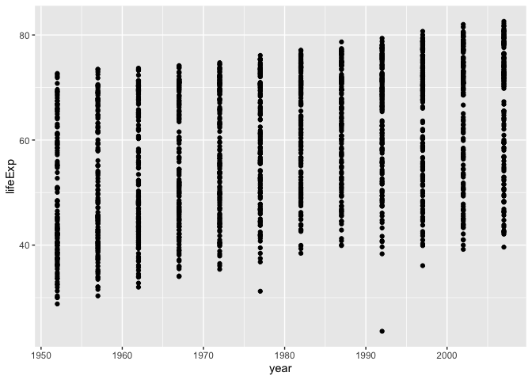
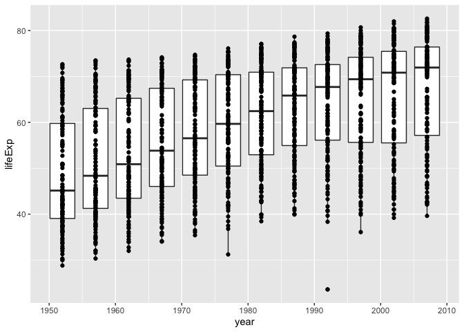
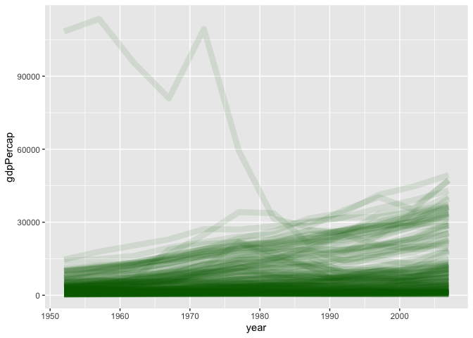
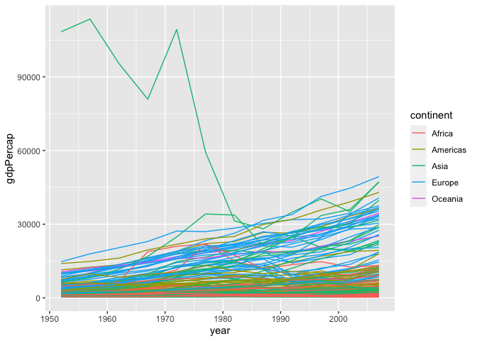
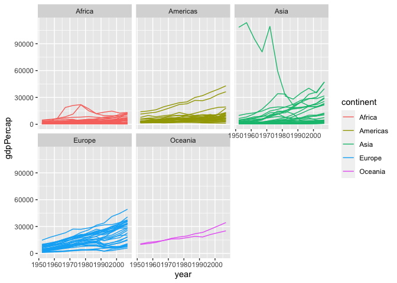
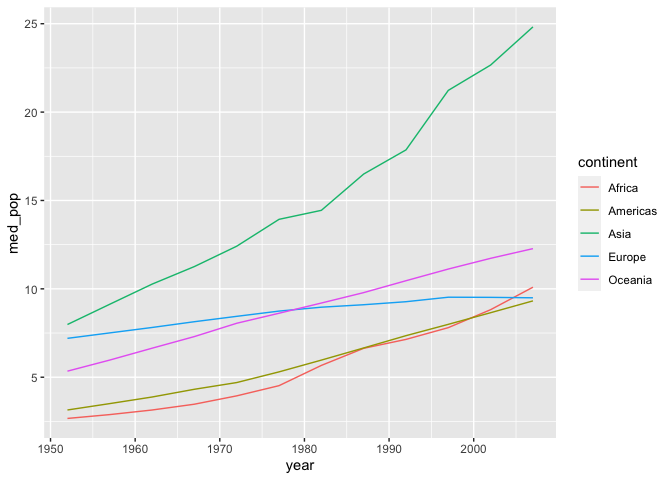

Manipulation des données c'est _fun_.


```r
library(tidyverse)
```

```
## ── Attaching packages ── tidyverse 1.2.1 ──
```

```
## ✔ ggplot2 3.2.1.9000     ✔ purrr   0.3.2     
## ✔ tibble  2.1.3          ✔ dplyr   0.8.3     
## ✔ tidyr   0.8.3          ✔ stringr 1.4.0     
## ✔ readr   1.3.1          ✔ forcats 0.4.0
```

```
## ── Conflicts ───── tidyverse_conflicts() ──
## ✖ dplyr::filter() masks stats::filter()
## ✖ dplyr::lag()    masks stats::lag()
```

```r
library(gapminder)
```

## regarde les données


```r
gapminder
```

```
## # A tibble: 1,704 x 6
##    country     continent  year lifeExp      pop gdpPercap
##    <fct>       <fct>     <int>   <dbl>    <int>     <dbl>
##  1 Afghanistan Asia       1952    28.8  8425333      779.
##  2 Afghanistan Asia       1957    30.3  9240934      821.
##  3 Afghanistan Asia       1962    32.0 10267083      853.
##  4 Afghanistan Asia       1967    34.0 11537966      836.
##  5 Afghanistan Asia       1972    36.1 13079460      740.
##  6 Afghanistan Asia       1977    38.4 14880372      786.
##  7 Afghanistan Asia       1982    39.9 12881816      978.
##  8 Afghanistan Asia       1987    40.8 13867957      852.
##  9 Afghanistan Asia       1992    41.7 16317921      649.
## 10 Afghanistan Asia       1997    41.8 22227415      635.
## # … with 1,694 more rows
```

## ggplot2


```r
ggplot(gapminder, aes(x = year, y = lifeExp)) + 
  geom_point()
```

<!-- -->

Aussi possible avec des boxplots


```r
ggplot(gapminder, aes(x = year, y = lifeExp, group = year)) + 
  geom_boxplot() + 
  geom_point()
```

<!-- -->

line plot


```r
ggplot(gapminder,
       aes(x = year,
           y = gdpPercap,
           group = country)) + 
  geom_line(colour = "darkgreen",
            size = 3,
            alpha = 0.1)
```

<!-- -->

mapping to a group -- couleur par continent!


```r
ggplot(gapminder,
       aes(x = year,
           y = gdpPercap,
           group = country,
           colour = continent)) + 
  geom_line()
```

<!-- -->

facets


```r
ggplot(gapminder,
       aes(x = year,
           y = gdpPercap,
           group = country,
           colour = continent)) + 
  geom_line() + 
  facet_wrap(~continent)
```

<!-- -->

## manipuler avec dplyr


```r
head(gapminder)
```

```
## # A tibble: 6 x 6
##   country     continent  year lifeExp      pop gdpPercap
##   <fct>       <fct>     <int>   <dbl>    <int>     <dbl>
## 1 Afghanistan Asia       1952    28.8  8425333      779.
## 2 Afghanistan Asia       1957    30.3  9240934      821.
## 3 Afghanistan Asia       1962    32.0 10267083      853.
## 4 Afghanistan Asia       1967    34.0 11537966      836.
## 5 Afghanistan Asia       1972    36.1 13079460      740.
## 6 Afghanistan Asia       1977    38.4 14880372      786.
```

```r
# choose columns
select(gapminder, country, year)
```

```
## # A tibble: 1,704 x 2
##    country      year
##    <fct>       <int>
##  1 Afghanistan  1952
##  2 Afghanistan  1957
##  3 Afghanistan  1962
##  4 Afghanistan  1967
##  5 Afghanistan  1972
##  6 Afghanistan  1977
##  7 Afghanistan  1982
##  8 Afghanistan  1987
##  9 Afghanistan  1992
## 10 Afghanistan  1997
## # … with 1,694 more rows
```

```r
# observations after 2000
filter(gapminder, year > 2000)
```

```
## # A tibble: 284 x 6
##    country     continent  year lifeExp      pop gdpPercap
##    <fct>       <fct>     <int>   <dbl>    <int>     <dbl>
##  1 Afghanistan Asia       2002    42.1 25268405      727.
##  2 Afghanistan Asia       2007    43.8 31889923      975.
##  3 Albania     Europe     2002    75.7  3508512     4604.
##  4 Albania     Europe     2007    76.4  3600523     5937.
##  5 Algeria     Africa     2002    71.0 31287142     5288.
##  6 Algeria     Africa     2007    72.3 33333216     6223.
##  7 Angola      Africa     2002    41.0 10866106     2773.
##  8 Angola      Africa     2007    42.7 12420476     4797.
##  9 Argentina   Americas   2002    74.3 38331121     8798.
## 10 Argentina   Americas   2007    75.3 40301927    12779.
## # … with 274 more rows
```

```r
# population in millions
mutate(gapminder, pop_millions = pop / 1e6)
```

```
## # A tibble: 1,704 x 7
##    country     continent  year lifeExp      pop gdpPercap pop_millions
##    <fct>       <fct>     <int>   <dbl>    <int>     <dbl>        <dbl>
##  1 Afghanistan Asia       1952    28.8  8425333      779.         8.43
##  2 Afghanistan Asia       1957    30.3  9240934      821.         9.24
##  3 Afghanistan Asia       1962    32.0 10267083      853.        10.3 
##  4 Afghanistan Asia       1967    34.0 11537966      836.        11.5 
##  5 Afghanistan Asia       1972    36.1 13079460      740.        13.1 
##  6 Afghanistan Asia       1977    38.4 14880372      786.        14.9 
##  7 Afghanistan Asia       1982    39.9 12881816      978.        12.9 
##  8 Afghanistan Asia       1987    40.8 13867957      852.        13.9 
##  9 Afghanistan Asia       1992    41.7 16317921      649.        16.3 
## 10 Afghanistan Asia       1997    41.8 22227415      635.        22.2 
## # … with 1,694 more rows
```

```r
## lowest populations
arrange(gapminder, pop)
```

```
## # A tibble: 1,704 x 6
##    country               continent  year lifeExp   pop gdpPercap
##    <fct>                 <fct>     <int>   <dbl> <int>     <dbl>
##  1 Sao Tome and Principe Africa     1952    46.5 60011      880.
##  2 Sao Tome and Principe Africa     1957    48.9 61325      861.
##  3 Djibouti              Africa     1952    34.8 63149     2670.
##  4 Sao Tome and Principe Africa     1962    51.9 65345     1072.
##  5 Sao Tome and Principe Africa     1967    54.4 70787     1385.
##  6 Djibouti              Africa     1957    37.3 71851     2865.
##  7 Sao Tome and Principe Africa     1972    56.5 76595     1533.
##  8 Sao Tome and Principe Africa     1977    58.6 86796     1738.
##  9 Djibouti              Africa     1962    39.7 89898     3021.
## 10 Sao Tome and Principe Africa     1982    60.4 98593     1890.
## # … with 1,694 more rows
```

```r
arrange(gapminder, desc(lifeExp))
```

```
## # A tibble: 1,704 x 6
##    country          continent  year lifeExp       pop gdpPercap
##    <fct>            <fct>     <int>   <dbl>     <int>     <dbl>
##  1 Japan            Asia       2007    82.6 127467972    31656.
##  2 Hong Kong, China Asia       2007    82.2   6980412    39725.
##  3 Japan            Asia       2002    82   127065841    28605.
##  4 Iceland          Europe     2007    81.8    301931    36181.
##  5 Switzerland      Europe     2007    81.7   7554661    37506.
##  6 Hong Kong, China Asia       2002    81.5   6762476    30209.
##  7 Australia        Oceania    2007    81.2  20434176    34435.
##  8 Spain            Europe     2007    80.9  40448191    28821.
##  9 Sweden           Europe     2007    80.9   9031088    33860.
## 10 Israel           Asia       2007    80.7   6426679    25523.
## # … with 1,694 more rows
```

enchainer les operations!

`browseVignettes("magrittr")`


```r
set.seed(1234)
exp(mean(rnorm(20), trim = 2))
```

```
## [1] 0.5892995
```

```r
set.seed(1234)
rnorm(20) %>% mean(trim = 2) %>% exp
```

```
## [1] 0.5892995
```


```r
gapminder %>% 
  select(continent, country, year, pop) %>% 
  filter(continent == "Oceania") %>% 
  mutate(pop_mil = pop / 1e6)
```

```
## # A tibble: 24 x 5
##    continent country    year      pop pop_mil
##    <fct>     <fct>     <int>    <int>   <dbl>
##  1 Oceania   Australia  1952  8691212    8.69
##  2 Oceania   Australia  1957  9712569    9.71
##  3 Oceania   Australia  1962 10794968   10.8 
##  4 Oceania   Australia  1967 11872264   11.9 
##  5 Oceania   Australia  1972 13177000   13.2 
##  6 Oceania   Australia  1977 14074100   14.1 
##  7 Oceania   Australia  1982 15184200   15.2 
##  8 Oceania   Australia  1987 16257249   16.3 
##  9 Oceania   Australia  1992 17481977   17.5 
## 10 Oceania   Australia  1997 18565243   18.6 
## # … with 14 more rows
```

## summarizing data


```r
gapminder %>% 
  ## average population by continent
  group_by(continent) %>% 
  summarize(median_gdp = median(gdpPercap),
            n_observations = n())
```

```
## # A tibble: 5 x 3
##   continent median_gdp n_observations
##   <fct>          <dbl>          <int>
## 1 Africa         1192.            624
## 2 Americas       5466.            300
## 3 Asia           2647.            396
## 4 Europe        12082.            360
## 5 Oceania       17983.             24
```


```r
gapminder %>% 
  # convert to millions
  mutate(pop_million = pop / 1e6) %>% 
  # calculate median per year per continent
  group_by(continent, year) %>% 
  summarise(med_pop = median(pop_million)) %>% 
  ggplot(aes(x = year, y = med_pop, colour = continent)) + 
  geom_line()
```

<!-- -->

